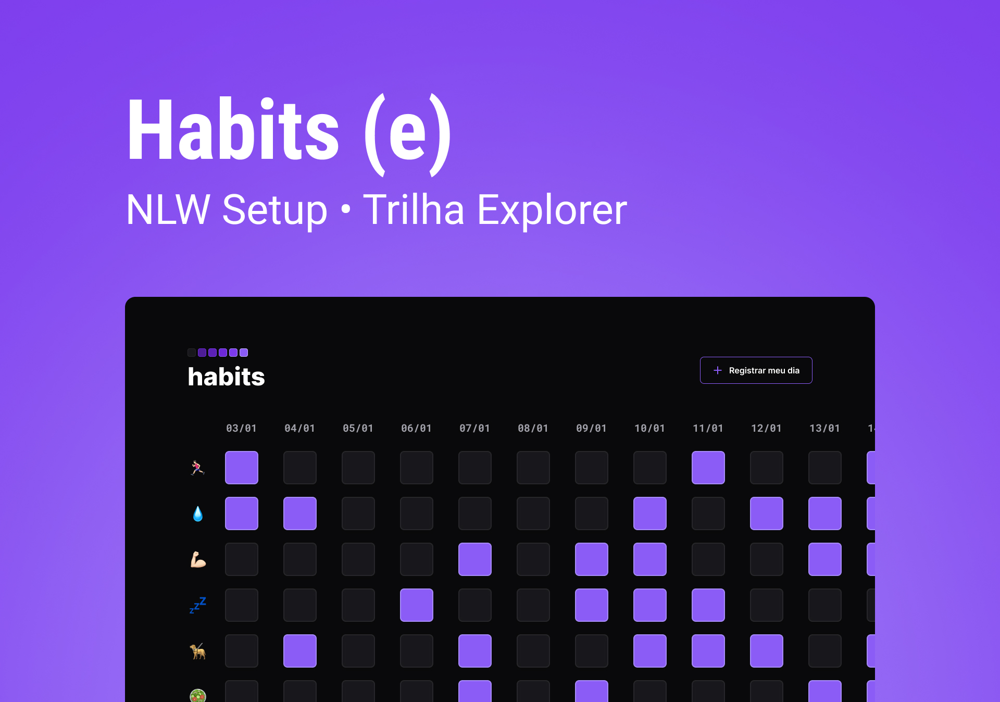

<h1 align="center">Habits</h1>

Projeto criado juntamente com NLW-Setup que é um evento exclusivo e gratuito, promovido pela Rocketseat para ensino de tecnologias WEB com objetivo de melhorar minhas <b>hard-skills</b>. 

  <a href="#-tecnologias">Tecnologias</a>&nbsp;&nbsp;&nbsp;|&nbsp;&nbsp;&nbsp;
  <a href="#-projeto">Projeto</a>&nbsp;&nbsp;&nbsp;|&nbsp;&nbsp;&nbsp;
  <a href="#-layout">Layout</a>&nbsp;&nbsp;&nbsp;|&nbsp;&nbsp;&nbsp;
  <a href="#-licença">Licença</a>

 

  

---

 

  

 

## 🚀 Tecnologias

Esse projeto foi desenvolvido com as seguintes tecnologias:

- HTML e CSS
- JavaScript
- Git e Github
- Figma

 

## 💻 Projeto

O Habits é um app para ajudar a rastrear os hábitos.

- [Visite o projeto online](https://dwmedeirosdev.github.io/NLW-Setup/)

 

## 🔖 Layout

Você pode visualizar o layout do projeto através desse [LINK](https://www.figma.com/file/EHAWnJbAO3G91qaCtnczu8/Habits-(e)-(Community)?node-id=75%3A567&t=KkGLp0cozHqAf73Z-1). É necessário ter conta no [FIGMA](https://figma.com) para acessá-lo.

 

## 📝 Licença

Esse projeto está sob a licença MIT.

 

---

<h3 align="center">Feito por David Medeiros<h3>
